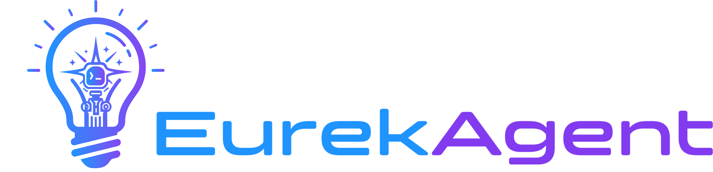

<p align="center">
  
</p>

<p align="center">
  <em>Define the problem and metric. Get breakthrough results.</em>
</p>

<p align="center">
  <a href="LICENSE"></a>
  <a href="https://arxiv.org/abs/2606.13662"></a>
  
  
  
  
  
  
</p>

<p align="center">
  Define your problem and evaluation criteria — EurekAgent coordinates off-the-shelf CLI agents to <strong>propose</strong> diverse approaches, <strong>implement</strong> them, <strong>run experiments</strong>, and <strong>iterate</strong>. Human intervention is optional but supported at every step.
</p>

<p align="center">
  <a href="#news">News</a> · <a href="#overview">Overview</a> · <a href="#quick-start">Quick Start</a> · <a href="#setting-up-a-new-problem">New Problem</a> · <a href="#useful-tips">Useful Tips</a> · <a href="#results">Results</a> · <a href="#contributing">Contributing</a> · <a href="#commercial-licensing">Commercial Licensing</a> · <a href="#citation">Citation</a>
</p>


<a id="news"></a>
## 📰 News

- **2026/06/13** — EurekAgent has been accepted to the BAAI Agent4S workshop! Join us for our presentation at the BAAI conference on June 13th, 2026 in Beijing. Slides will be available soon.
- **2026/06/12** — v0.1.0 released!

<a id="overview"></a>
## 🔍 Overview

We present **EurekAgent**, an agent system for metric-driven autonomous scientific discovery. Define your problem and evaluation criteria — EurekAgent coordinates off-the-shelf CLI agents to propose diverse approaches, implement them, run experiments, and iterate. Human intervention is optional but supported at every step. 

https://github.com/user-attachments/assets/c5b45b20-7eec-454e-98c3-6880bcec878b


<!-- todo: put demo video here -->

### Highlights

- **Environment engineering first** — provides strong CLI agents with the resources, constraints, artifacts, budgets, and human interfaces needed for reliable autonomous discovery.
- **End-to-end research loop** — proposes approaches, implements code, evaluates submissions, and iterates toward better results.
- **Problem-defined evaluation** — uses your `INSTRUCTION.md`, `SUBMISSION_FORMAT.md`, and private `evaluate.py` as the source of truth.
- **Isolated execution** — runs agent work and grading in separate Docker containers for secure, sandboxed experiments.
- **Resumable long runs** — flexibly interrupt and resume a run from persisted state.
- **User-friendly interfaces** — optionally chat with agents through the TUI, and track live cost stats, score evolution, and full session logs in the web monitor.

<a id="quick-start"></a>
## 🚀 Quick Start

### 1. Install Docker and Node.js 22+

**Docker** — follow the [official guide](https://docs.docker.com/engine/install/) for your platform. Then add your user to the `docker` group:

```bash
sudo usermod -aG docker $USER
# Check if the user is added to docker group
groups $USER
```

**Node.js 22+** — the agent container is built on the `node:22-bookworm` image, so install a matching **Node.js 22+** runtime on the host as well (from [nodejs.org](https://nodejs.org/) or via [nvm](https://github.com/nvm-sh/nvm)) and confirm:

```bash
nvm install 22
node --version   # must be v22 or newer
```

### 2. Install Claude Code

EurekAgent drives the experiment loop through [Claude Code](https://docs.claude.com/en/docs/claude-code/overview). It runs both on your **host** (for the `/generate-inputs` skill and problem authoring) and **inside the agent container** (preinstalled by the Docker image below).

**a) Install Claude Code on the host (requires Node.js 22+ from Step 2):**

```bash
npm install -g @anthropic-ai/claude-code
claude --version   # sanity check
```

**b) Authenticate and point Claude Code at your model endpoint.**
EurekAgent forwards these into the agent container, so configure them once in
`~/.claude/settings.json` under the `"env"` block:

```json
{
  "env": {
    "ANTHROPIC_AUTH_TOKEN": "YOUR_KEY_HERE",
    "ANTHROPIC_BASE_URL": "YOUR_BASE_URL_HERE",
    "ANTHROPIC_DEFAULT_SONNET_MODEL": "glm-5.1",
    "API_TIMEOUT_MS": "3000000"
  },
  "model": "sonnet"
}
```

### 3. Install Python dependencies

```bash
# Install uv (if not already installed)
curl -LsSf https://astral.sh/uv/install.sh | sh
source ~/.bashrc

# Clone and enter the project
git clone https://github.com/THU-Team-Eureka/EurekAgent.git && cd EurekAgent

# Install uv-managed Python 3.12
uv python install 3.12.12
```


### 4. Pull the base image and build the container

```bash
docker pull node:22-bookworm
bash docker/build.sh
```

Verify the image is available:

```bash
docker images | grep eureka-agent
```

If you are behind a proxy or `docker pull` fails, see the [Docker troubleshooting guide](assets/TROUBLESHOOTING.md).

### 5. (Recommended) Configure MCP servers for web access

During a run the agent can search the web for problem context and read live pages. These MCP servers are **optional** — when absent, the agent falls back to Claude Code's built-in `WebSearch`. `web-search-prime` is intended for GLM users; users of other model providers can skip it or configure their preferred search MCP.

**a) [`web-search-prime`](https://docs.z.ai/devpack/mcp/search-mcp-server) — structured web search for GLM users only**

```bash
claude mcp add -s user -t http web-search-prime https://api.z.ai/api/mcp/web_search_prime/mcp --header "Authorization: Bearer YOUR_KEY_HERE"
```

**b) [`playwright`](https://github.com/microsoft/playwright-mcp) — fetch and read actual webpage content.**:

```bash
claude mcp add playwright npx @playwright/mcp@latest
npx playwright install chromium        # pre-install the headless browser
```

EurekAgent ships a Playwright config at `.claude/playwright-mcp.json` (headless Chromium, sandbox flags, timeouts). It is mounted read-only into the agent container automatically — create or edit that file to match your network (e.g. add a proxy) if needed.

### 6. Run an example
```bash
bash examples/circle_packing/run.sh
```

<a id="setting-up-a-new-problem"></a>
## 🧠 Setting Up a New Problem

You can use the `/generate-inputs` skill in Claude Code to interactively generate all required files (INSTRUCTION.md, SUBMISSION_FORMAT.md, evaluate.py, run.sh) from a natural language description of your problem. Just type `/generate-inputs` and follow the prompts.

Each problem lives in its own directory under `examples/`. You need the following files:

### Required Files

| File | Purpose | Required? |
|------|---------|-----------|
| `INSTRUCTION.md` | Problem description for the LLM agent | Yes |
| `SUBMISSION_FORMAT.md` | JSON schema for candidates + score semantics | Yes |
| `hidden_eval_dir/evaluate.py` | Private evaluator with `grade_submission` and `is_better` | Yes |
| `initial.py` | Starting code for the agent | Recommended |
| `run.sh` | Convenience script to launch a run | Recommended |

### evaluate.py Specification

The evaluator is the single source of truth for scoring and comparison. It must define two functions:

#### `grade_submission(submission_path: str, context: dict) -> dict`

Called by the secure grader server to score a candidate submission.

- **Parameters**:
  - `submission_path`: path to the JSON file the agent submitted
  - `context`: dict with `workspace_root`, `approach_id`, `metadata`
- **Returns** a dict with:
  - `score` (float): the raw objective value. Do NOT negate. Return the value as-is (e.g., the C5 value for a minimization problem, or sum of radii for a maximization problem).
  - `valid` (bool): whether the submission is valid
  - `message` (str): human-readable feedback
  - `opt_target_met` (bool, optional): whether an optimization target was met
  - `public_metrics` (dict, optional): additional metrics for display
- **Invalid submissions**: return a score that can never be "best". Use `float("inf")` for minimization problems, `float("-inf")` for maximization, or `float("inf")` for approach-target problems.

#### `is_better(new_score: float, old_score: float) -> bool`

Defines which score is better. Called by the system to compare scores for ranking, best-result tracking, and display.

- **Returns**: `True` if `new_score` represents a better result than `old_score`
- **Examples**:
  - Minimization: `return new_score < old_score`
  - Maximization: `return new_score > old_score`
  - Approach target (e.g., π): `return abs(new_score - 3.14159) < abs(old_score - 3.14159)`

Both functions are **required**. The system will fail at startup if either is missing.

### INSTRUCTION.md

Must clearly state:
- The optimization objective and its direction (minimize, maximize, approach target, etc.)
- Constraints and validation rules
- Known best results (if any) or target score
- The contract for the `run()` function

### SUBMISSION_FORMAT.md

Must describe:
- Required JSON keys and their types
- Score semantics (e.g., "Score is the raw C5 value. Lower is better.")
- Invalid submission behavior

### run.sh

A convenience script. Must pass at minimum:
- `--problem`: path to INSTRUCTION.md
- `--hidden-eval-dir`: path to the directory containing evaluate.py
- `--submission-format`: path to SUBMISSION_FORMAT.md
- `--model`: the model to use
- Time budget flags: `--propose-time-limit-per-session` + `--implement-time-limit-per-session`

Example:

```bash
cd "$(dirname "$0")/../.."

uv run python -m src \
    --model glm-5.1 \
    --problem examples/my_problem/INSTRUCTION.md \
    --hidden-eval-dir examples/my_problem/hidden_eval_dir \
    --submission-format examples/my_problem/SUBMISSION_FORMAT.md \
    --initial-code examples/my_problem/initial.py \
    --propose-time-limit-per-session "20 minutes" \
    --implement-time-limit-per-session "120 minutes" \
    --max-num-approaches 3 \
    --max-loops 5 \
    --gpus auto \
    --adapter-mode "pty"
```

GPU selection defaults to `--gpus auto`. For CPU-only runs, pass `--gpus none`.
For a Linux NVIDIA server, pass explicit IDs such as `--gpus 0,1` if you want
to restrict the run to a subset of GPUs.


<a id="useful-tips"></a>
## 💡 Useful Tips

### Best practices for new problems

- Design evaluators defensively: consider obvious reward-hacking paths, invalid outputs, hidden-test leakage, tolerance abuse, filesystem side effects, and score tampering.
- Include the current SOTA, best known score, or target score in `INSTRUCTION.md` so agents know what result they are trying to beat.

### Monitor & snapshots

- **Live monitor** — starts automatically in the background during a run (disable with `--no-monitor`, pick a port with `--monitor-port`). It prints a `Web monitor: http://127.0.0.1:<port>` URL you can open in a browser.
- **Static snapshot** — when a run finishes, a self-contained `monitor_snapshot.html` is written into the run directory so you can review it after the server is gone.
- **Historical snapshot** — regenerate one fully offline (no eureka process, server, or Docker needed — it reads only from disk):

```bash
# Latest run is auto-selected when you point at the runs/ parent:
uv run python -m src.monitor.server --runs-dir runs --snapshot
# ...or a specific run:
uv run python -m src.monitor.server --run-dir runs/<run_id> --snapshot
```

The snapshot is written into the run's directory as `monitor_snapshot.html` — open it in a browser.

### Docker runtime model

EurekAgent runs in Docker mode by default. Each run uses two containers:

- **Agent container**: runs Claude Code sessions and sees the run workspace at `/workspace`.
- **Grader container**: runs the secure evaluation server and also sees `/workspace`, so it can read submitted files and write official results.

The hidden evaluator directory (`hidden_eval_dir`) is mounted only into the grader container, read-only, at `/hidden_eval`. It is not mounted into the agent container, so agent code can submit candidates and receive scores but cannot directly read or modify the private evaluator.

The host/controller uses the project `.venv`, while containers use a persistent Linux venv under `.eureka_docker/venvs/...` mounted as `/workspace/.venv`. Delete `.eureka_docker/venvs` to force recreation of the container Python environment.

<a id="results"></a>
## 📊 Results

EurekAgent achieves strong results across mathematics, kernel engineering, and machine learning tasks. It sets new state-of-the-art results on all evaluated mathematics and kernel engineering tasks, and ranks first by medal rate on our seven-task MLE-Bench subset. On the three mathematical optimization tasks, each run used less than $17 in API cost.

| Domain | Task | Previous Best AI | EurekAgent |
|--------|------|------------------|------------|
| Mathematics | Circle Packing (↑) | 2.635986 | **2.635999** |
| Mathematics | Erdős' Min. Overlap (↓) | 0.380876 | **0.380870** |
| Mathematics | 1st Autocorr. Ineq. (↓) | 1.502863 | **1.502861** |
| Kernel Engineering | TriMul (↓) | 2247.78 μs | **2005.03 μs** |
| Machine Learning | MLE-Bench subset (↑) | 71.43% | **85.71%** |


<a id="contributing"></a>
## 🤝 Contributing

Contributions are welcome! Whether it's bug reports, feature ideas, or pull requests — every bit helps. For substantial changes, please open an issue first to discuss the design, and keep changes focused, documented, and covered by relevant tests when possible.

We especially welcome contributions for Windows support and additional CLI-agent adapters, such as Codex.

### How to Contribute

1. Fork the repository
2. Create your feature branch (`git checkout -b feature/amazing-feature`)
3. Commit your changes (`git commit -m 'Add amazing feature'`)
4. Push to the branch (`git push origin feature/amazing-feature`)
5. Open a Pull Request

<a id="commercial-licensing"></a>
## 💼 Commercial Licensing

This project is licensed under [AGPL-3.0](LICENSE). For commercial licensing inquiries, please contact: **xin-x25@mails.tsinghua.edu.cn** or **xiaojn25@mails.tsinghua.edu.cn**

<a id="citation"></a>
## 📚 Citation

If you find EurekAgent useful for your research, please cite our [paper](https://arxiv.org/abs/2606.13662):

```bibtex
@misc{xin2026eurekagent,
  title = {EurekAgent: Agent Environment Engineering is All You Need For Autonomous Scientific Discovery},
  author = {Amy Xin and Jiening Siow and Junjie Wang and Zijun Yao and Fanjin Zhang and Jian Song and Lei Hou and Juanzi Li},
  year = {2026},
  eprint = {2606.13662},
  archivePrefix = {arXiv},
  primaryClass = {cs.AI},
  url = {https://arxiv.org/abs/2606.13662}
}
```
